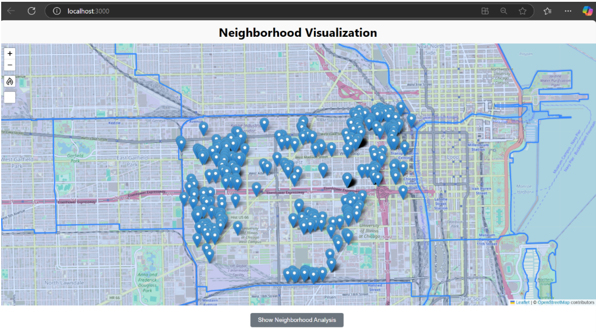
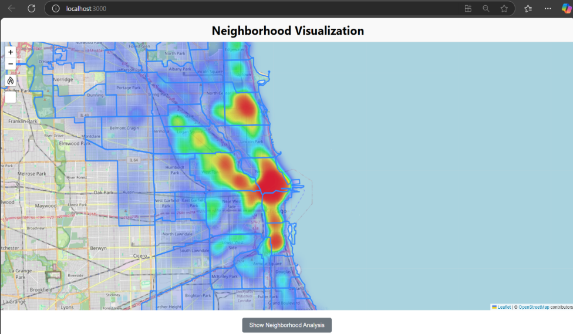
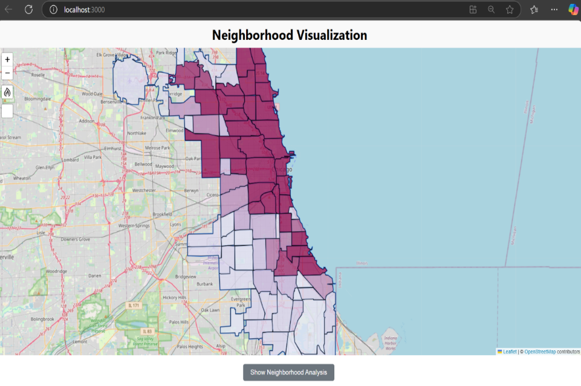
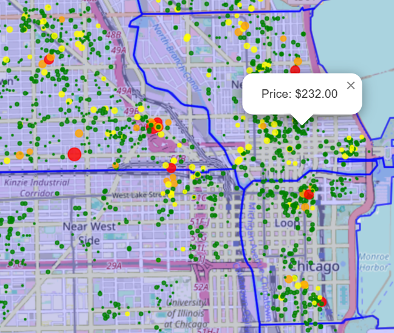
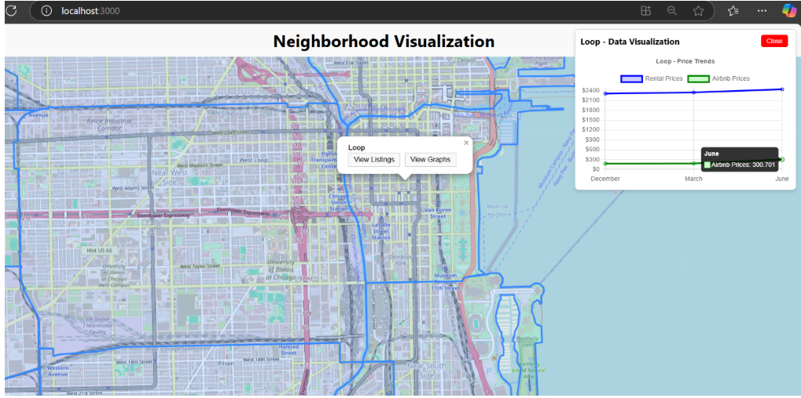
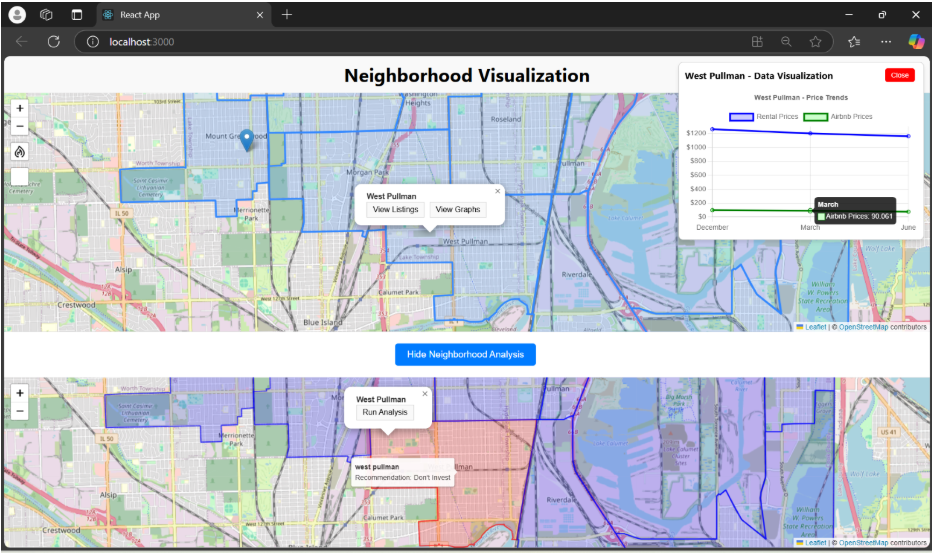
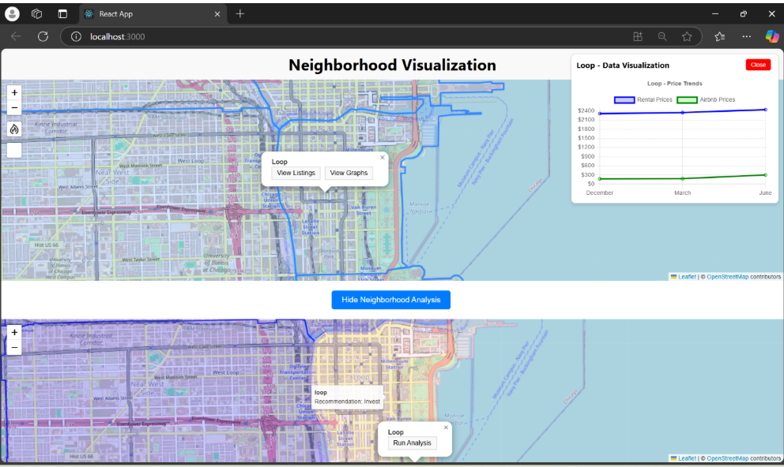

# Airbnb's Impact

This is the study that investigates the impact of Airbnb on local housing markets, focusing on whether neighbourhoods with a high concentration of Airbnb listings experience increased real estate prices or reduced long-term rental availability. Using datasets from Airbnb and Zillow, the analysis incorporates enhanced visualizations created with D3, including heatmaps, choropleth maps, and bubble plots, to illustrate spatial trends and market dynamics.


The team includes:

* Uday Bhaskar Voora (University of Illinois Chicago)
* Sravan Kilaru (University of Illinois Chicago)
* Om Naga Sai Mani Pavan Chamarthi (University of Illinois Chicago)

## Project Report
Our Project Report Can be accessed Here
* Project Report : [Report](https://drive.google.com/file/d/1n9_TVA_K15iqKD7MOheAKIiJY_6PkhZv/view?usp=sharing)

## Table of contents

   * [Problem Description](#Problem-Description)
   * [Data Summary](#Data-Summary)
   * [Running AirBNBs Impact](#Running-AirBNBs-Impact)
   * [Results](#Results)
   * [Technical Implementation](#Technical-Implementation)
   * [Future Contributions](#Future-contributions)


## Problem Description

This project focuses on the United States housing market to examine the extent of Airbnb's influence on real estate prices and the availability of long-term rentals. Specifically, it investigates whether neighbourhoods with a high density of Airbnb listings experience a significant increase in real estate prices or a reduction in long-term rental availability. The study leverages comprehensive datasets, including over 280,000 Airbnb listings spanning 2020–2023, and integrates them with Zillow property price data. By employing advanced data cleaning techniques and focusing on geographic attributes such as neighbourhoods and zip codes, the analysis ensures a contextually accurate representation of local market dynamics. 


## Data Summary
### Dataset Overview

#### Airbnb Dataset:
The Airbnb dataset, sourced from the Inside Airbnb platform, contains detailed information about Airbnb listings across various cities. For this analysis, dataset includes the following attributes: 

* Property Name: Identifies the Airbnb listing by name. 

* Price: Specifies the rental cost of the property per day or night. 

* Geolocation: Provides latitude and longitude details for mapping and spatial analysis. 

* Availability: Indicates the average number of days the property is available for rental. 

* Neighbourhood Region: Categorizes listings into specific neighbourhoods for localized analysis. 

This dataset, spanning 2020–2023, contains over 280,000 records, enabling an extensive evaluation of Airbnb trends and their influence on the housing market.

#### Zillow-Dataset: 
The Zillow dataset complements the Airbnb data by providing detailed property rental values for each neighbourhood in Chicago for understanding. It includes: 

* Rental Values: Monthly rental prices for properties in different neighbourhood’s 

* Time Frame: Covers the last five years, offering historical context to observe trends over time. 

* Zip codes: Contains the region names (neighbourhood names) in zip code format for each specific region/neighbourhood. 

### Dataset Access
The datasets can be accessed through : 
* Air BNB Dataset : [AirBNB](https://insideairbnb.com/get-the-data/)
* Zillow Dataset : [Zillow](https://www.zillow.com/research/data/)


## Running AirBNB's Impact
The following are prerequisites for all systems:
* Node.js (v14 or latest version)
* Python 3.8+

### Setup 
Install Node.js dependencies:
	
 	npm install

Start the application :

 	 npm start

You can access the application at (```http://localhost:3000```)
## Results
### Key Findings:
* Visualization of AirBNB's locations
* Particularly useful for identifying clusters of Airbnb activity and analysing their proximity to neighbourhood boundaries.
* This grouping enables us for further analysis of the relationship between Airbnb density and rental prices in specific neighbourhoods.
* Airbnb will be located in based on the zip code or region. This visualization bridges the Airbnb dataset, which originally lacked zip codes, with the Zillow dataset that provided zip code data for neighborhoods.

* Heatmap demonstrates the distribution of Airbnb listings.
* The intensity of the heatmap changes from blue to orange to red, with red areas indicating higher densities of listings in specific neighbourhoods.
* The heatmap facilitates a temporal analysis by comparing the density of Airbnb listings across the chosen timestamps.

* choropleth map highlights the distribution of Airbnb activity and rental prices across neighbourhoods in Chicago.
* The map uses varying shades of colour, with darker shades indicating neighbourhoods with higher values, such as increased AirBNB density.

* Bubble plot overlaying neighbourhood data to visualize the price variations of Airbnb listings across different regions in Chicago.
* The plot uses color-coded bubbles to represent price ranges such as (Green: Affordable or low-priced listings), (Orange: Moderately priced listings) and (Red: Expensive listings). 
* This color-coded system provides an intuitive understanding of price disparities across neighbourhoods.

* Our core analysis lies in predicting whether the effects of Airbnb activity on rental prices are positive or negative, ultimately aiding decisions about real estate investments. 
* This showcases an interactive feature where users can view and analyse the price variation over time for specific neighbourhoods. 
* In this example, the Loop neighbourhood has been selected, allowing users to explore detailed price trends for both rental properties and Airbnb listings within this area.
* The graph on the right enables users to hover over specific points to observe price variations across different time periods.
* This interactivity helps in understanding how neighbourhood dynamics change over time and provides actionable insights for stakeholders like investors, policymakers, and realtors.
* Blue Line (Rental Price Trend): This graph represents the rental price trends for the Loop neighborhood based on the zipcode.
* Green Line (Airbnb Price Trend): This graph depicts the weighted average price of Airbnb listings in the corresponding zip code for the Loop.

*  Visualization to help users determine whether to invest in a specific neighborhood.
*  The selected neighborhood in the example is West Pullman, where the "Run Analysis" feature has been used to evaluate its investment potential.
*  The outcome suggests "Don't Invest", with the neighborhood turning red, indicating that current trends in Airbnb and rental prices do not favor investment. 
* The tool determines its recommendations based on price trends over time.
* It suggests "Invest" when both Airbnb and rental prices are increasing in a neighborhood, signaling strong demand and 
growth potential.
* Conversely, it shows "Don't Invest" when the prices for both Airbnb and rentals are declining, indicating reduced demand or a cooling market

* The below figure provides another example where the "Run Analysis" feature recommends investing in the selected neighbourhood and it turns out to be green color.
* Upon cross-checking using the "View Graphs" option, the price trends show an upward trajectory, validating the analysis's prediction to invest. 

## Technical Implementation
### Technical Stack
* React for UI components
* Visual Studio tool to run the application
* Material-UI for styling
* Leaflet Open street map for mappings
* D3.js for data visualization
* Recharts for data visualization

## Future Contributions
* Fork this repository
* Create a new branch (```git checkout -b branch name```)
* Commit your contribution to the branch (```git commit -m 'your contribution'```)
* Push the work to the orginal branch (```git push origin branch name```)
* Open a Pull Request


